# git学习

## 第一章 入门

安装

https://www.bilibili.com/video/BV1vy4y1s7k6?p=7&vd_source=0a405165a0113ee09ca06983b8c642af

### 1.1 版本控制(VCS)

版本控制是一套系统，该系统按时间顺序记录某一个或一系列文件的变更

版本控制是一种记录文件变化，方便用户查看历史版本

#### 1.1.1 本地版本控制

使用简单数据库保存文件变更(RCS)

#### 1.1.2 集中式版本控制(CVCS)

#### 1.1.3 分布式版本控制系统(DVCS)

### 1.2 Git基础

#### 1.2.1 快照，而非差异

- 其他版本控制系统将其存储的信息视为一组文件及对这些文件随时间做出的变更。
- Git将数据存储为随时间变化的项目快照

#### 1.2.2 几乎所有操作在本地进行

#### 1.2.3 Git完整性

#### 1.2.4 Git通常只增加数据

#### 1.2.5 三种状态

在Git中，文件可以处于以下三种状态：

- 已提交(committed):数据已经被安全的存入本地数据库中
- 已修改(modified):已经改动了文件，但尚未提交到数据库
- 已暂存(staged):对已修改文件的当前版本做出标识并将其加入下一次要提交的快照中

 

 

- workspace：工作区
- staging area：暂存区/缓存区
- local repository：版本库或本地仓库
- remote repository：远程仓库

 

Git的基本工作流如下:

1. 修改工作目录中的文件
2. 暂存文件，将这些文件的快照加入暂存区
3. 提交暂存区的文件，将快照永久的保留在Git目录中

#### 1.2.6 安装Git

- Linux上安装方法 $ sudo apt-get install git-all
- Windows官网下载Git/下载GitHub

#### 1.2.7 Git常用命令

Exc + :wq退出编辑

Cat+文件名读取文件

|            命令名称             |      作用      |
| :-----------------------------: | :------------: |
| git  config --global user.name  |   设置用户名   |
| git  config --global user.email |  设置用户邮箱  |
|            git  init            |  初始化本地库  |
|           Git  status           | 查看本地库状态 |
|         Git add 文件名          |  添加到缓存区  |
| Git commit -m "日志信息"文件名  |  提交到本地库  |
|           Git  reflog           |  查看历史纪录  |
|     Git reset --hard 版本号     |    版本穿梭    |
|             git log             |  查看版本信息  |
|    git log --pretty=oneline     |  查看版本信息  |

## 第二章 Git基础

### 2.1 获取Git仓库

#### 2.1.1 在现有目录中初始化Git仓库

- 初始化:

$ git init

这会创建一个名为.git的子目录。这个子目录包含了构成Git仓库骨架的所有必须文件。但此时Git尚未跟踪项目中的任何文件。

- 对现有文件（**非空目录**进行版本控制），应该开始跟踪这些文件并进行初次提交。

$ git add *.c
$ git add LICENSE
$ git commit -m 'initial project version'

#### 2.1.2 克隆现有仓库

git clone [url]

git clone [url] 自定义名字

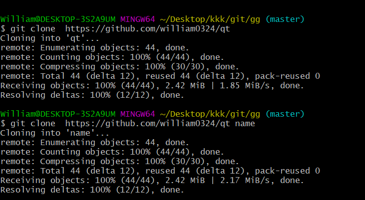

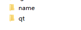

#### 2.1.3 检查文件状态

所有已跟踪文件在上次提交后都未被更改过：

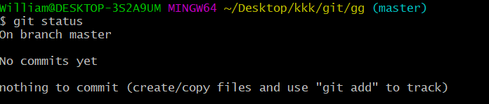

有没被跟踪的文件

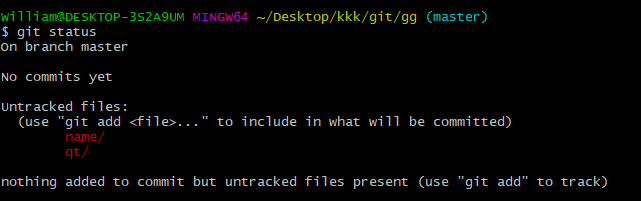

git status -s状态解析

A: 你本地新增的文件（服务器上没有）.

C: 文件的一个新拷贝.

D: 你本地删除的文件（服务器上还在）.

D: 你本地删除的文件（服务器上还在）.

 R: 文件名被修改了。

T: 文件的类型被修改了。

U: 文件没有被合并(你需要完成合并才能进行提交)。

X: 未知状态(很可能是遇到git的bug了，你可以向git提交bug report)git 

？：未被git进行管理，可以使用git add file1把file1添加进git能被git所进行管理

 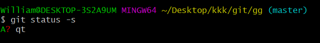

#### 2.1.4 跟踪新文件

$ git add 文件名

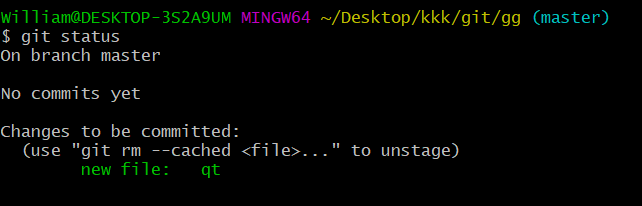

此时`qt` 文件已被跟踪，并处于暂存状态, `git add` 命令使用文件或目录的路径作为参数；如果参数是目录的路径，该命令将递归地跟踪该目录下的所有文件。

#### 2.1.5 忽略文件

[详见网址]: https://www.cnblogs.com/kevingrace/p/5690241.html

#### 2.1.6 提交更新

$ git commit -m "信息描述"

#### 2.1.7 版本回退

```
$ git reset --hard HEAD^ //HEAD表示当前版本，则HEAD^表示上一个版本，那么上上版本就是HEAD^^
```

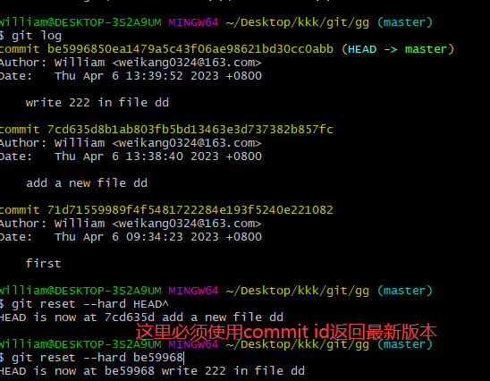

#### 2.1.8 修改对比

无修改没信息

git diff 就是我们本地正在开发的但未提交到暂存区文件和之前已经提交到暂存区里的文件的对比；（add之前和add之后比较）

git diff head 就是已经提交到版本库环境中的文件和未提交到版本库环境中文件的所有修改对比；（commit之后与add之前对比）

```
$ git diff HEAD -- readme.txt 
```

git diff --cached 最后一次提交到版本库环境中文件和暂存区中文件的修改对比；（commit之后与add之后对比）

#### 2.1.9 撤销修改

(1) 没有 git add 之前

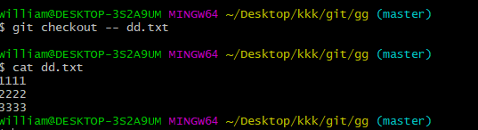

(2) `git add`了，但没有`git commit`

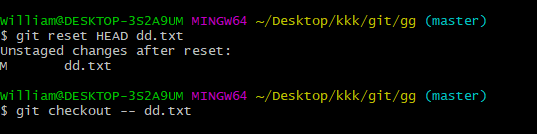

(3) 既 `git add` 了，也 `git commit` 了

可以回退到上一个版本，见回退版本内容。

#### 2.1.10 删除文件

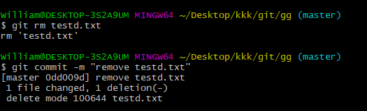

## 第三章 Git分支

### 3.1 什么是分支

在版本控制过程中，同时推进多个任务，为每个任务，我们就可以创建每个任务的单独分支。程序员可以使用分支把自己的工作从开发主线上分离开来，开发自己分支时，不会影响主线分支的运行。

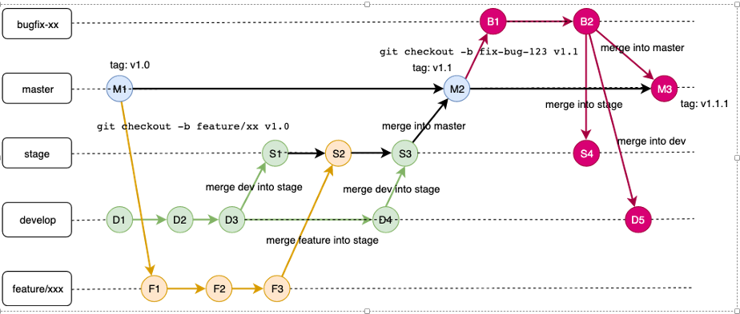

### 3.2 分支的操作

| 命令名称            | 作用                         |
| ------------------- | ---------------------------- |
| Git branch 分支名   | 创建分支                     |
| Git  branch -v      | 查看分支                     |
| Git checkout 分支名 | 切换分支                     |
| Git merge 分支名    | 把指定的分支合并到当前分支上 |
| git branch –d name  | 删除分支                     |

合并分支

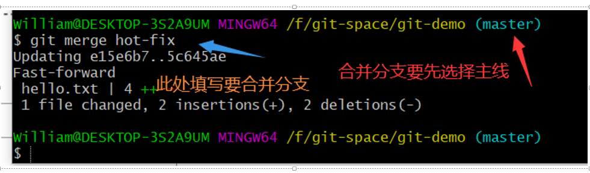

## 第四章 创建远程仓库

| 命令名称                     | 作用                                                 |
| ---------------------------- | ---------------------------------------------------- |
| Git  remote -v               | 查看当前所有远程地址别名                             |
| Git remote add 别名 远程地址 | 起别名                                               |
| Git push 别名 分支           | 推送本地分支上的内容到远程仓库                       |
| Git clone 远程地址           | 将远程仓库的内容克隆到本地                           |
| Git pull 远程库地址别名      | 将远程仓库对于分支最新内容拉下来后与本地分支直接合并 |

 github操作流程

1.创建仓库

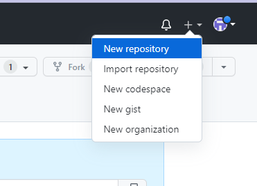


2.添加远程库

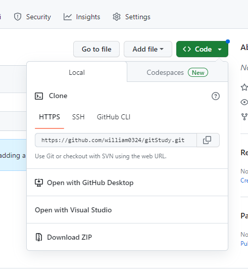

 

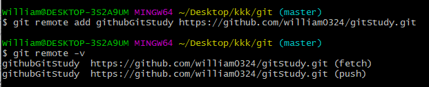

3.推送

因为远程库是空的，所以我们在第一次推送 master 分支时，要加上 `-u` 参数，Git不但会把本地的 master 分支内容推送的远程新的 master 分支，还会把本地的 master 分支和远程的 master 分支关联起来，在以后的推送或者拉取时就可以简化命令。

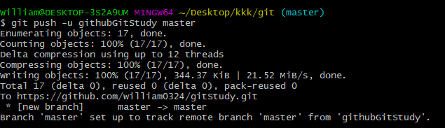